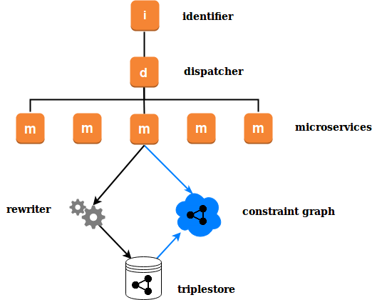

# Mu Query Rewriter

The mu-query-rewriter is a proxy service for enriching and constraining SPARQL queries before they are sent to the database, as part of the [mu-semtech](http://mu.semte.ch) microservice architecture.

## Introduction 

A constraint is expressed as a standard SPARQL `CONSTRUCT` query, which conceptually represents an intermediate 'constraint' graph. An incoming query is optimally rewritten to a form which, when run against the full database, is equivalent to the original query being run against the constraint graph. Constraining queries in this way allows shared logic to be abstracted almost to the database level, simplifying the logic handled by each microservice. 



The principle use case is modelling access rights directly in the data (Graph ACL), so that an incoming query is effectively run against the subset of data which the current user has permission to query or update.

A simpler use case would be using multiple graphs to model data in such a way that individual microservices do not need to be aware of the rules determining which triples are stored in which graph. 

### Example

The following constraint, where `rdf:type` is declared as a "functional property" (see below), defines a model where bikes and cars are stored in separate graphs, and users can be authorized to see one or both of the types.

```
CONSTRUCT {
  ?a ?b ?c
}
WHERE {
 {
  GRAPH <cars> {
   ?a ?b ?c;
      a <Car>.
  }
  GRAPH <auth> {
   <SESSION> mu:account ?user.
   ?user <authFor> <Car>
  }
 }
 UNION {
  GRAPH <bikes> {
   ?a ?b ?c;
      a <Bike>.
  }
  GRAPH <auth> {
   <SESSION> mu:account ?user.
   ?user <authFor> <Bike>
  }
 }
}
```

When a microservice in the mu-semtech architecture (so the identifier has assigned a `mu-session-id`) makes the following the query:

```
SELECT *
WHERE {
  ?s a <Bike>;
     <hasColor> ?color.
}
```

the rewriter will actually query the database:

```
SELECT ?s ?color
WHERE {
  GRAPH <bikes> {
    ?s a <Bike>;
       <hasColor> ?color.
  }
  GRAPH <auth> {
   <session123456> mu:account ?user.
   ?user <authFor> <Bike>
  }
}
```

## Running the Proxy Service

The Query Rewriter runs as a proxy service between the application and the database. It exposes a SPARQL endpoint `/sparql` that accepts GET and POST requests, following the SPARQL specifications, and passes on all received headers to the database.

### Configuration

The Query Rewriter supports the following environment variables:

- `MU_SPARQL_ENDPOINT`: SPARQL read endpoint URL. Default: http://database:8890/sparql in Docker, and http://localhost:8890/sparql outside Docker.`.
- `MU_SPARQL_UPDATE_ENDPOINT`: SPARQL update endpoint. Same defaults as preceding.`.
- `PORT`: the port to run the application on, defaults to 8890.
- `MESSAGE_LOGGING`: turns logging on or off.
- `PRINT_SPARQL_QUERIES`: when "true", print all SPARQL queries.
- `CALCULATE_ANNOTATIONS`: when "true" (default), annotations will be calculated and returned in the headers
- `PLUGIN`: plugin filename, must be located in the `/config` directory (in Docker).

### Example docker-compose file

```
version: "2"
services:
  db:
    image: tenforce/virtuoso
    environment:
      SPARQL_UPDATE: "true"
      DEFAULT_GRAPH: "http://mu.semte.ch/application"
    ports:
      - "8890:8890"
    volumes:
      - ./data/db:/data
  rewriter:
    image: nathanielrb/mu-graph-rewriter
    links:
      - db:database
    environment:
      MESSAGE_LOGGING: "true"
      PRINT_SPARQL_QUERIES: "true"
      CALCULATE_ANNOTATIONS: "true"
      REWRITE_SELECT_QUERIES: "true"
      PLUGIN: "authorization.scm"
    volumes:
      - ./config/rewriter:/config
    ports:
      - "4027:8890"
  my-service:
    image: my/service
    links:
      - rewriter:database
```

## Describing Constraints

A constraint is a SPARQL `CONSTRUCT` statement of one triple, called the "matched triple".

Write and read/write constraints have a further restriction: the graph containing the matched triple must be a variable, to ensure that update queries only insert or delete triples when the constraint succeeds:

### Limitations and Exceptions

Due to the complexity of the SPARQL 1.1 grammar, not all SPARQL queries are fully supported.

The property paths `*`, `+` and `?` are constrained identically to the corresponding single-jump triple, e.g., `?s ?p* ?o` is considered subject to the same constraints as `?s ?p ?o`.

## Writing Plugins

The [graph-acl-sandbox](https://github.com/nathanielrb/graph-acl-basics/) provides a UI for writing and testing Query Rewriter plugins. This section describes how to write plugins directly in Chicken Scheme. 

### API

**[procedure]** `(define-constraint mode constraint)` 

`mode` is a symbol, and can take the values `'read/write`, `'read` or `'write`

`constraint` can be a string or a procedure of zero arguments returning a string; the template `<SESSION>` will be replaced dynamically with the `mu-session-id` header.

**[parameter]** `*functional-properties*`

A list of IRIs (symbols) of properties which, for any given subject, can only have one value.

**[parameter]** `*query-functional-properties?*

#t or #f. Query the database directly for values of functional properties, when the subject is an IRI.

**[parameter]** `*unique-variables*`

A list of variables (symbols) which are considered unique for a single query, and therefore not rewritten.

### Example 

```
(*functional-properties* '(rdf:type))

(*query-functional-properties?* #t)

(*unique-variables* '(?user))

(define-constraint  
  'read/write 
  (lambda ()    "
PREFIX mu: <http://mu.semte.ch/vocabularies/core/>
PREFIX graphs: <http://mu.semte.ch/school/graphs/>
PREFIX school: <http://mu.semte.ch/vocabularies/school/>
PREFIX foaf: <http://xmlns.com/foaf/0.1/>

CONSTRUCT {
 ?a ?b ?c.
}
WHERE {
 GRAPH <authorization> {
  <SESSION> mu:account ?user
 }
 GRAPH ?graph {
  ?a ?b ?c.
  ?a rdf:type ?type.
 }
 VALUES (?graph ?type) { 
  (graphs:grades school:Grade) 
  (graphs:subjects school:Subject) 
  (graphs:classes school:Class) 
  (graphs:people foaf:Person) 
 }
}  "))
```

